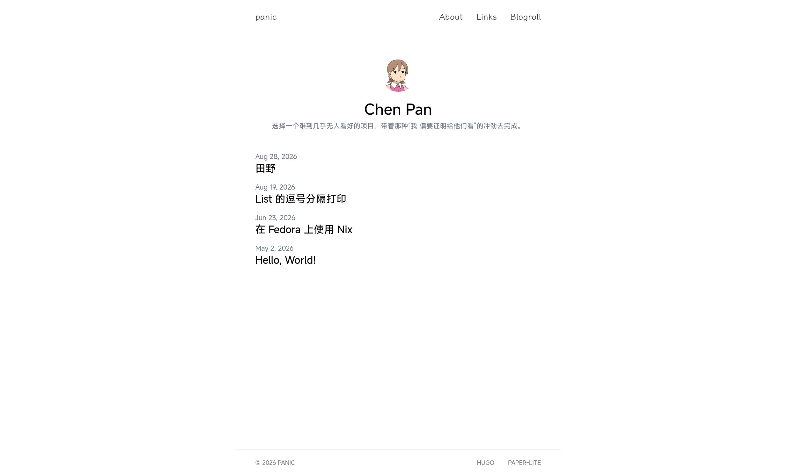
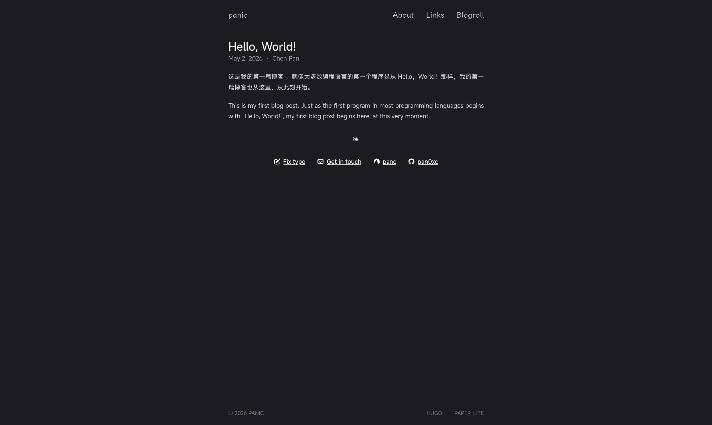

### Hugo PagerLite

**A simple, clean, hackable theme for [Hugo](https://gohugo.io/).**

> Based on [hugo-paper](https://github.com/nanxiaobei/hugo-paper), with extra features, customization options, and easy to hack on.

## Overview

## Features

`Fast | Hackable | Lightweight`

- **Auto light/dark theme** — Follows browser/OS color scheme.
- **Blog Subscription** -- Subscribe to someone else's blog.
- **Multiple authors** -- Native support for multi-author sites.
- **Responsive layout** — Desktop, tablet, and mobile ready.
- **SEO optimized** — Semantic HTML, meta tags, Open Graph, sitemap, and RSS.
- **Zero JavaScript** — Pure HTML/CSS, no JS at all.

## Support

- **Start** - Star this repository to show your support.
- **Help** — [Open an issue](https://github.com/pan0xc/hugo-paper-lite/issues).
- **Contributions** — PRs are welcome.

## Thanks

- [南小北](https://github.com/nanxiaobei)
- [Hugo](https://github.com/gohugoio/hugo)
- [tailwindcss-typography](https://github.com/tailwindlabs/tailwindcss-typography)
- All contributors and supporters
